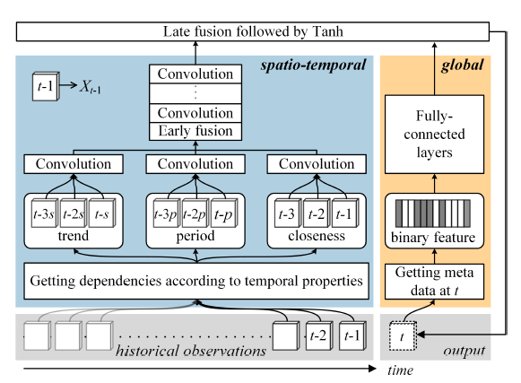

# Reference Summary

## [DNN-Based Prediction Model for Spatio-Temporal Data](http://dl.acm.org/citation.cfm?id=2997016) 

### Keywords
+ End-to-end model for Spatio-temporal data
+ Usage of domain knowledge

### Summary
+ Input Sequence(OR)
  1. Image patches 
  2. Pretrained features (VGG etc.)

+ Representation
   Cell state and Output state of the encoder.
+ Output Sequence(OR/AND)
   1. Original input (reconstruction)
   2. Predict other sequence (prediction)

+ Evaluation

  1. Evaluation based on output sequence

  2. (Further) Representation as initializations for supervised task

     Action recognition on UCF-101/HMDB-51:
     Stacked LSTM, initialized by representations, softmax prediction, 

+ Decoder

  1. Predicts a long sequence instead of a single frame
  2. What is the input x for unconditional decoders?

+ wonmin answer:
     - input for unconditioned lstm: \[v3', v2', v1'\] (reverse output of encoder)
     - input for conditioned lstm: \[v3', v2'', v1''\] (output of previous timestep in the decoder) 

+ Conclusion
  1. Representation works. 
  2. Composite model gives the best result. 
  3. Conditioning does not make a big difference.
+ Future work
  1. applying it convolutionally across patches of the video and stacking multiple layers of such models.
+ Tricks
  1. Target sequence in reverse order: WHY? make optimizer easier because low-range correlations.
  2. Conditional/Unconditional decoders
  3. RMSProp converge faster than SGD with momentum

### Architecture

