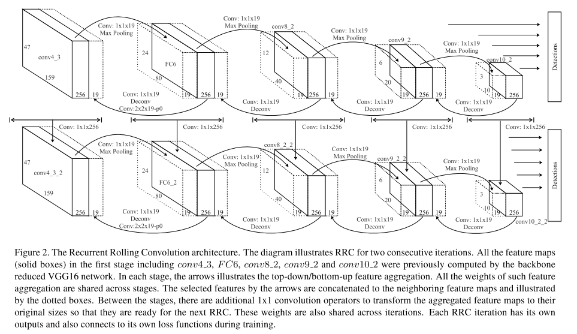

## [Accurate Single Stage Detector Using Recurrent Rolling Convolution](https://arxiv.org/pdf/1704.05776.pdf)

### Recent object detection solutions

1. Two stage methods (Faster R-CNN and its variants)
    - First stage: generate plausible proposals
    - Second stage: decision refinement
    - Accurate but slow
2. Single-shot methods (YOLO, SSD and more)
    - Fast because of its single stage architecture
    - Hard to accurately localize objects

### A profound understanding of the drawbacks of the above methods

- In SSD and its variants, though exploiting the usage of multiple feature maps of different resolutions, it is not able to outperform state-of-art two stage methods. SSD can be mathematically defined as:
   
    $$ \varphi_{n}=f_{n}(\varphi_{n-1})=f_{n}(f_{n-1}(...f_{1}(I))) $$
    
    $$ Detection={\cal {D}}(\tau_{n}(\varphi_{n}),...,\tau_{n-k}(\varphi_{n-k})), n>k>0 $$
    
    where $ \varphi_{n} $ is the feature maps in the layer $ n $, $ f_{n}(\cdot) is the non-linear block and $ \tau_{n}(\cdot) is the function to transform the n-th feature maps to the detection result for a certain scale range.

    Since the feature maps in each layer is solely responsible for the ouput of its scale, SSD fails to generate accurate detections. In other word, it assumes each $ \varphi $ to be sophisticated enough, i.e. includes both fine-grained feature, high-level semantic abstraction and also appropriate contextual information.

- In Faster R-CNN, both small and large objects are detected based on the last feature map which is especially problematic for detecting small objects. The last feature map, which is in low resolution, cannnot provide fine-grained details of the small objects. Faster R-CNN can be defined mathematically as follows:
    
    $$ Region proposals={\cal {R}}(\tau_{n}(\varphi_{n})) n>0 $$

    The only $ \varphi_{n} $ lacks fine-grained feature for small objects.

### Rules to satisfy

1. Feature maps should have enough resolution
2. Function to transform input image to feature maps should be deep enough to incorporate high level abstraction
3. Feature maps should contain appropriate contextual information

### Proposed architecture

$$ Detection=\hat{\cal {D}}(\tau_{n}(\hat{\varphi_{n}}({\cal {H}})),...,\tau_{n-k}(\hat{\varphi_{n-k}}({\cal{H}}))),
    {\cal {H}}=\{\varphi_{n},...,\vaarphi_{n-k}\}, n>k>0
    size(\varphi_{n-k})=size(\hat{\varphi_{n-k}}({\cal {H}})), \forall k $$

-  In this setting, the detection results rely on feature maps not only of high resolution but also incorporate features in deeper layers. It is worth noting that, the detetion results consist of multiple outputs of different feature maps. Specificly, aggregation of high-level and fine-grained feature maps are done through the proposed Recurret Rolling technique as depicted in the following figure.

 