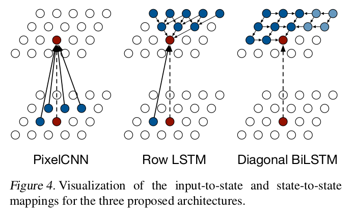
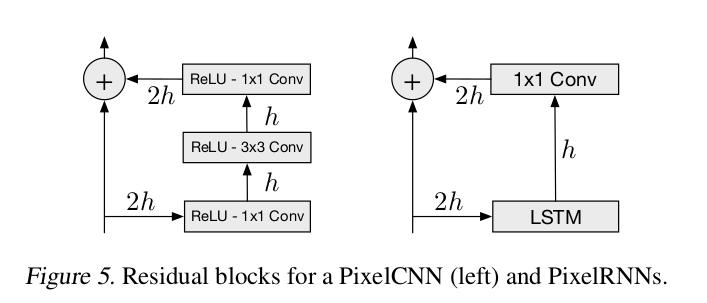
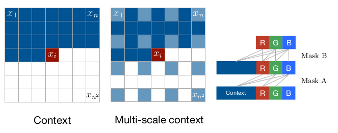

## Pixel Recurrent Neural Networks

### Abstract

1. Present a model that sequentially predicts the pixels in an image along two spatial dimensions.
2. Models the discrete probability of the raw pixel values and encodes the complete set of dependencies in the image.

### Introduction

1. PixelRNN, up to 12, fast 2-D LSTM layers

   Two types of these layers

   + Row LSTM layer (Conv applied along each row)
   + Diagonal BiLSTM

2.  PixelCNN

   + Masked convolutions
   + 15 layers that preserves the spatial resolution of the input throughout the layers and outputs a conditional distribution at each location

3. Both model capture generality of pixel inter-dependencies without introducing independence assumptions

### Model

1. Generate image pixel by pixel

   Conditional scheme, one pixel conditional on all left-up pixels. Also conditioned on the other channels.

2. Row LSTM and Diagonal BiLSTM

   

3. Residual connections

   

4. Masked Convolution

   Mask A and B for ease of conv computation. (Zero out weight)

   

5. ​