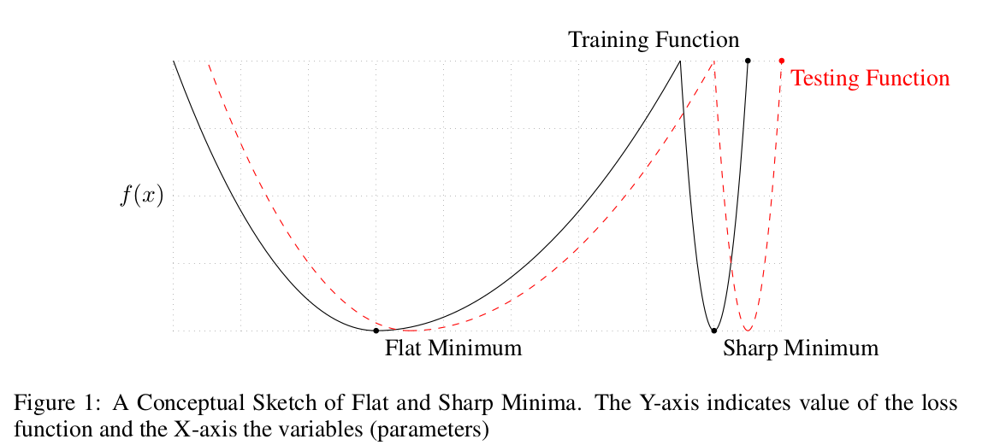

## [On Large-Batch Training for Deep Learning: Generalization Gap and Sharp  Minima](https://arxiv.org/abs/1609.04836)

### Intro

1. Observed in practice that when using a larger batch there is a degradation in the quality of the model, as the ability to generalize
2. Reason: sharp minima lead to poorer generalization
3. Several strategies to attempt help large-batch size.

### Drawback of large-batch methods

These minimizers are characterized by a significant number of large positive eigenvalues in $$\nabla_2f$$, and tend to generalize less well.

It is often reported that when increasing the batch size for a problem, there exists a threshold after which there is a deterioration in the quality of the model. 

### Improve

1. Data augmentation
   + The application of this technique is domain specific but generally involves augmenting the data set through controlled modifications on the training data. For instance, in the case of image recognition, the training set can be augmented through translations, rotations, shearing and flipping of the training data. This technique leads to regularization of the network and has been employed for improving testing accuracy on several data sets.
   + Result: Generalization better. But the sharpness of the minima still exists
2. Conservative training
   + convergence rate of SGD for the large-batch setting can be improved by obtaining iterates through the following proximal sub-problem.
   + $$x_{k+1} = \arg \min_x \frac{1}{|B_k|}\sum_{i\in B_k}f_i(x) + \frac{\lambda}{2}||x-x_k||_2^2$$
   + there is a statistically significant improvement in the testing accuracy of the large-batch method but it does not solve the problem of sensitivity.
3. Robust training
   + A natural way of avoiding sharp minima is through robust optimization techniques. These methods attempt to optimize a worst-case cost as opposed to the nominal (or true) cost (Adversarial training also one kind)
   + $$\min_x \phi(x) := \max_{||\Delta x \leq\epsilon||}f(x+\Delta x)$$
   + Geometrically, classical (nominal) optimization attempts to locate the lowest point of a valley, while robust optimization attempts to lower an $$\epsilon$$–disc down the loss surface.
   + Fail: this strategy did not improve generalization
